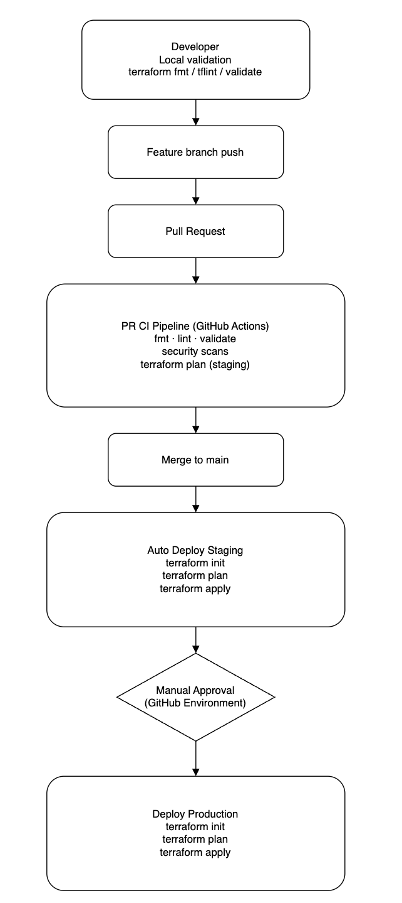

# CI/CD

## 1. Setup an end-to-end pipeline from dev to deployment for this scenario

### 1. Developer Workflow

**Goal:** catch issues before PR to reduce CI noise and shorten feedback cycles.

Recommended local steps:
- `terraform fmt -recursive`
- `tflint --init && tflint`
- `terraform init -backend=false`
- `terraform validate`

### 2. Branching and Promotion Model

- Feature branches → **Pull Request** → merge to `main`
- `main` auto-deploys to **staging**
- **production** deploy requires manual approval (GitHub Environments)

### 3. CI: Pull Request Validation + Plan (No Deployment)

**Trigger:** `pull_request` affecting `terraform/**`  
**Goal:** block broken or unsafe infra changes before merge.

PR pipeline stages:

1. **Checkout**
2. **Quality gates**
   - `terraform fmt -check -diff -recursive`
   - `tflint` (with AWS plugin and pinned versions)
3. **Terraform correctness**
   - `terraform init -backend=false`
   - `terraform validate`
4. **Security gates**
   - Trivy config scan (IaC misconfig) and/or Checkov
   - GitHub secret scanning (repo setting) + optional Trivy secret scan
5. **Plan for target environment (staging)**
   - Configure AWS creds via OIDC
   - `terraform init` with remote backend (staging state key)
   - `terraform plan -var-file=env/staging.tfvars`

### 4. CD: Deploy to Staging Automatically on Merge

**Trigger:** push to `main`  
**Goal:** continuously converge staging to the latest approved code.

---

### 5. Promotion: Deploy to Production with Approval

**Trigger:** after successful staging deployment, gated by `environment: production` approval  
**Goal:** controlled production changes with audit trail.

---

## 2. Recommended Tools

### CI/CD Orchestration
- **GitHub Actions**
  - Native integration with pull requests and protected environments
  - Built-in support for manual approvals via environments
  - OIDC integration with AWS (no long-lived credentials)

### Infrastructure as Code
- **Terraform**
  - Declarative infrastructure definition
  - Remote state in **S3** with **DynamoDB** locking
  - Environment separation via backend keys and `tfvars`

### Code Quality
- **terraform fmt**
  - Enforces consistent formatting
- **terraform validate**
  - Ensures configuration correctness
- **TFLint**
  - Detects Terraform and AWS best-practice issues
  - Pluggable rulesets and custom policies

### Security
- **Trivy (IaC + secrets scanning)** or **Checkov**
  - Detects insecure Terraform configurations
- **GitHub native secret scanning**
  - Prevents accidental credential leakage
- **AWS IAM + OIDC**
  - Short-lived credentials, least-privilege access

---

---

## 3. CI/CD Lifecycle (End-to-End)

### 1. Pull Request – Continuous Integration (CI)
Triggered on `pull_request` for changes under `terraform/**`.

**Purpose:** fast feedback, prevent bad infrastructure from reaching `main`.

Steps:
1. Checkout code
2. Run **TFLint**
3. Run **terraform fmt -check**
4. Run **terraform init (no backend)** and **terraform validate**
5. Run **terraform plan (staging)** against real remote state

Outcome:
- All quality and security checks must pass
- Reviewers can inspect the plan before merge
- No infrastructure is modified

---

### 2. Merge to `main` – Continuous Deployment to Staging
Triggered on push to `main`.

**Purpose:** automatically deploy validated changes to staging.

Steps:
1. Re-run baseline checks (dependency on `terraform-checks`)
2. Authenticate to AWS using OIDC
3. Initialize Terraform with **staging backend**
4. Apply Terraform using `staging.tfvars`

Outcome:
- Staging environment always reflects `main`
- Early detection of integration/runtime issues

---

### 3. Promotion to Production – Controlled Release
Triggered after successful staging deployment.

**Purpose:** safe and auditable production changes.

Steps:
1. Manual approval via **GitHub environment: production**
2. Assume dedicated production AWS role
3. Initialize Terraform with **production backend**
4. Apply Terraform using `prod.tfvars`

Outcome:
- Human control before production changes
- Clear audit trail of who approved and deployed

---

## 4. Code Quality in the Pipeline

Code quality is enforced early to reduce risk and rework.

- **Formatting (`terraform fmt`)**
  - Ensures consistent code style
  - Prevents noisy diffs and review friction

- **Static analysis (`tflint`)**
  - Catches misconfigurations and AWS anti-patterns
  - Improves maintainability and reliability

- **Validation (`terraform validate`)**
  - Guarantees syntactic and semantic correctness
  - Prevents broken plans and applies

These checks run on every pull request and block merges on failure.

---

## 5. Security in the Pipeline

Security is integrated using a **shift-left** approach.

### Preventive Controls (PR stage)
- **IaC scanning (Trivy / Checkov)**
  - Detects public exposure, missing encryption, weak IAM
- **Secret scanning**
  - Blocks accidental commits of credentials

### Deployment Controls
- **OIDC-based AWS authentication**
  - Eliminates static access keys
- **Environment-scoped IAM roles**
  - Separate, least-privilege roles for staging and production

### Governance Controls
- **Manual approval for production**
  - Reduces blast radius of mistakes
- **Remote state locking**
  - Prevents concurrent or conflicting applies

---

## 6. Key Benefits of This Design

- Clear separation of **CI (validation)** and **CD (deployment)**
- Strong quality and security gates before infrastructure changes
- Immutable promotion from PR → staging → production
- Auditable, repeatable, and low-risk Terraform deployments